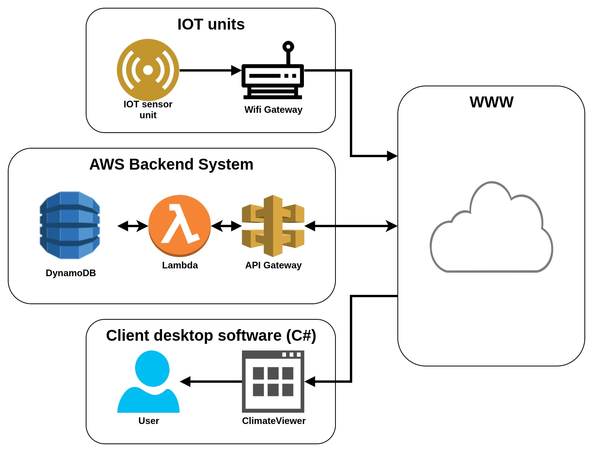

# Jesper Kielsgaard - Graduation project 2018
## Data technician with specializing in programming graduation project

Name: Jesper Kielsgaard 
School: Tech College Aalborg 
Grade: 10/B

## eexam description
The Data technician graduation project is a 6 weeks exam and contain
1. Case preparation and problem definition
2. Two raports. a process report and a product report total about 30-40 pages 
3. Product designing, planning and development of the product
4. Presentation of the produkt and another technological theory (NoSQL)

## Project description
The project cases are based on my own everyday life, where I found a need to measure and collect climate data.

The final product is a Smart Home solution, which employs a number of different technologies.

## Product Technologies
>IOT units
- NodeMCU ESP8266 Wi-Fi developer boards with a DHT22 digital temperature and humidity sensor.
- Firmware C/C++

>Backend System (AWS services)
- API Gateway (https://aws.amazon.com/api-gateway/)
- Lambda function written Node.js (https://aws.amazon.com/lambda/)
- DynamoDB (https://aws.amazon.com/dynamodb/)

>ClimateViewer (Desktop client software) 
- C# / WPF desktop application (Framework that are used is Newtonsoft.Json and LiveChart)

## Product description
Brief explanation regarding the Product from the product chart
- IOT devices collects and transmits the climate data to the AWS backend system
- AWS Backend system receives and processes API requests from IOT devices and users
- AWS Backend system stores climate data on NoSQL database
- Client Desktop Software visualize the climate data stored in the backend system

## Product chart

## Product images #1

## Product images #2
